<!-- _class: lead -->
<!-- _paginate: false -->

# Day 1: Teach Claude with Skills

### From repeated prompting to reusable expertise

**Build:** a release-notes Skill · **Format:** explain, demo, lab

---

## Outcomes

By 16:30, learners can:

1. Explain when a Skill is better than a prompt or `CLAUDE.md`
2. Create a valid project Skill with supporting files
3. Control invocation, arguments, and tool access
4. Test triggering and output quality with a simple evaluation matrix


---

## Day plan

| Time | Module | Mode |
|---|---|---|
| 09:00 | Mental model and anatomy | Teach |
| 10:15 | Build the first Skill | Demo + lab |
| 13:00 | Arguments, tools, supporting files | Workshop |
| 14:30 | Evaluation and troubleshooting | Demo + lab |
| 16:00 | Review and teach-back | Checkpoint |

Breaks: 10:00, 12:00, and 14:15.

---

## Prompt, memory, or Skill?

| Use | Best when | Loaded |
|---|---|---|
| Prompt | One-off request | This turn |
| `CLAUDE.md` | Always-relevant project facts | Session start |
| Skill | Repeatable procedure or specialist knowledge | When invoked |

**Rule of thumb:** if you paste the same checklist twice, prototype a Skill.

---

## The Skill lifecycle



The description is the **routing contract**. The body is the **execution contract**.

---

## Minimum viable Skill

```text
.claude/
└── skills/
    └── release-notes/
        └── SKILL.md
```

```yaml
---
name: release-notes
description: Draft release notes from repository changes.
---

Summarize user-visible changes. Group them as Added, Changed, and Fixed.
```

The directory name creates `/release-notes`.

---

## Choose the right scope

| Scope | Location | Audience |
|---|---|---|
| Personal | `~/.claude/skills/<name>/SKILL.md` | You, across projects |
| Project | `.claude/skills/<name>/SKILL.md` | This repository and team |
| Plugin | `<plugin>/skills/<name>/SKILL.md` | Plugin users |
| Enterprise | Managed settings | Organization |

Start **project-local** while the workflow is still changing.

---

## Write a description that routes

Weak:

> Helps with releases.

Strong:

> Drafts customer-facing release notes from Git changes. Use when asked for a changelog, release summary, or announcement of completed work.

Include the **job**, **input context**, and phrases learners naturally use.

---

<!-- _class: demo -->

## Demo 1 · Inspect the starter

**Show:** `demos/day-1-skills/.claude/skills/release-notes/SKILL.md`

1. Point out frontmatter and imperative steps
2. Open `examples/good-release-notes.md`
3. Explain why detail lives outside `SKILL.md`

**Success signal:** learners can identify routing text versus instructions.

<!-- Presenter: Keep the file tree visible. Do not run Claude yet. 8 minutes. -->

---

<!-- _class: demo -->

## Demo 2 · Trigger it two ways

From `demos/day-1-skills`, start `claude`.

```text
Summarize the changes in this project for our customers.
```

Then invoke explicitly:

```text
/release-notes version 2.4
```

**Show on screen:** automatic match, `/` autocomplete, and final structure.

<!-- Presenter: Ask the room which words caused the automatic match. 12 minutes. -->

---

## Invocation controls

```yaml
disable-model-invocation: true
```

Use for deployments, sends, commits, or any workflow a person must start.

```yaml
user-invocable: false
```

Use for background knowledge that Claude may load but people should not run.

```yaml
allowed-tools: Read Grep
```

Pre-approves tools for the invoking turn; it does **not** remove other tools.

---

## Arguments and progressive disclosure

```markdown
Prepare notes for $ARGUMENTS.
```

`/release-notes version 2.4` supplies `version 2.4`.

Keep `SKILL.md` concise. Move depth into:

- `examples/` for expected outputs
- `reference.md` for domain rules
- `scripts/` for deterministic processing
- templates for exact output shapes

---

<!-- _class: exercise -->

## Lab 1 · Build a team Skill

**Timebox: 45 minutes**

1. Copy the starter Skill and rename the directory
2. Pick one repeated team workflow
3. Write three should-trigger and two should-not-trigger prompts
4. Add one supporting example or template
5. Test direct and automatic invocation in fresh sessions

**Deliverable:** Skill folder plus the five-prompt test matrix.

---

## Evaluate two separate things

| Test | Question | Evidence |
|---|---|---|
| Routing | Did the Skill trigger when it should? | Invocation observed |
| Quality | Did it improve the result? | Assertions passed |
| Efficiency | Was the added context worth it? | Time and tokens |

Compare each prompt **with the Skill and without it** in fresh sessions.

---

<!-- _class: demo -->

## Demo 3 · Diagnose a miss

1. Change the description to `Helps with text`
2. Ask: `Write customer-facing notes for these changes`
3. Observe the missed or uncertain match
4. Restore concrete trigger language
5. Start a fresh session and rerun

**Fallback:** invoke `/release-notes` directly and inspect frontmatter parsing.

<!-- Presenter: Use this failure intentionally. A clean failure teaches routing. 10 minutes. -->

---

## Trust boundaries

- Review project Skills before accepting workspace trust
- Minimize `allowed-tools`; never embed credentials
- Use `disable-model-invocation: true` for side effects
- Treat dynamic shell injection as code execution
- Prefer deterministic scripts for validation and transformations
- Test destructive and ambiguous inputs explicitly

> A Skill is executable guidance, not harmless documentation.

---

<!-- _class: checkpoint -->

## Day 1 checkpoint

Explain to a partner:

1. What causes a Skill to load?
2. Why keep supporting detail outside `SKILL.md`?
3. When must model invocation be disabled?
4. What is one should-not-trigger prompt for your Skill?

**Exit ticket:** commit your Skill and test matrix for use on Day 3.

---

<!-- _class: closing -->
<!-- _paginate: false -->

# Day 1 complete

Tomorrow: give Claude safe access to live tools and data with MCP connectors.

Reference: `https://code.claude.com/docs/en/skills`
