<!-- _class: lead -->
<!-- _paginate: false -->

# Day 2: Connect Claude with MCP

### From isolated assistant to trusted systems

**Build:** a local product-catalog connector · **Format:** explain, demo, lab

---

## Outcomes

By 16:30, learners can:

1. Explain MCP clients, servers, tools, resources, and prompts
2. Choose transport and configuration scope intentionally
3. Connect, inspect, invoke, and troubleshoot an MCP server
4. Apply least privilege and defend against prompt injection


---

## Day plan

| Time | Module | Mode |
|---|---|---|
| 09:00 | MCP mental model | Teach |
| 10:15 | Connect a local server | Demo + lab |
| 13:00 | Cloud connectors and authentication | Demo |
| 14:00 | Safety, scopes, and troubleshooting | Workshop |
| 15:15 | Design a connector workflow | Lab |

Breaks: 10:00, 12:00, and 14:45.

---

## MCP in one picture



MCP standardizes the boundary. It does not make every server trustworthy.

---

## Connector, server, and client

- **Claude Code** is the MCP client
- An **MCP server** exposes capabilities through the protocol
- A **connector** is the configured relationship to that server
- The server translates calls into an API, database, file, or service action

Claude.ai connectors use the same MCP infrastructure and can appear in Claude Code when subscription authentication is active.

---

## Three capability types

| Capability | Claude uses it to | Example |
|---|---|---|
| Tool | Perform an operation | `find_product` |
| Resource | Read addressable context | `catalog://products` |
| Prompt | Start a reusable interaction | `/mcp__catalog__compare` |

Tools are model-selected actions. Resources are referenced with `@`. Prompts appear as commands.

---

## Pick a transport

| Transport | Choose it for | Note |
|---|---|---|
| HTTP | Remote cloud service | Recommended remote option |
| stdio | Local process or script | Direct machine access |
| WebSocket | Bidirectional pushed events | Configure in JSON |
| SSE | Legacy remote service | Deprecated when HTTP exists |

The course demo uses **stdio**: no account, token, or network dependency.

---

## Pick a scope

| Scope | Stored in | Shared? |
|---|---|---|
| Local | `~/.claude.json`, per project | No |
| Project | `.mcp.json` | Yes |
| User | `~/.claude.json`, all projects | No |

Start local for experiments. Use project scope only after the team has reviewed the server and configuration.

---

<!-- _class: demo -->

## Demo 1 · Meet the server

**Show:** `demos/day-2-connectors/product-catalog-server.mjs`

1. Locate the `find_product` tool schema
2. Locate the `catalog://products` resource
3. Follow one request to the in-memory data source
4. Note that logs go to stderr, never protocol stdout

**Success signal:** learners can trace input, validation, and result.

<!-- Presenter: Keep this code tour under 12 minutes. -->

---

<!-- _class: demo -->

## Demo 2 · Add and inspect

From the course repository:

```powershell
claude mcp add --transport stdio --scope local product-catalog `
  -- node demos/day-2-connectors/product-catalog-server.mjs
claude mcp list
claude mcp get product-catalog
```

Start `claude`, open `/mcp`, and confirm **connected** with capabilities listed.

<!-- Presenter: If the server already exists, remove it first with claude mcp remove product-catalog. -->

---

<!-- _class: demo -->

## Demo 3 · Use tools and resources

In Claude Code:

```text
Find a product suitable for a remote worker under $150.
```

Then type `@` and select the catalog resource:

```text
Compare @product-catalog:catalog://products by price and stock.
```

**Show on screen:** tool selection, permission prompt, structured result, resource autocomplete.

---

<!-- _class: exercise -->

## Lab 1 · Connect and query

**Timebox: 40 minutes**

1. Add the local `product-catalog` server
2. Verify it with `claude mcp list` and `/mcp`
3. Ask one precise and one ambiguous product question
4. Reference `catalog://products` with `@`
5. Record which capability Claude chose and why

**Deliverable:** two prompts, observed tool/resource use, and one improvement.

---

## Cloud connector path

For a claude.ai connector:

1. Open `https://claude.ai/customize/connectors`
2. Add or select a reviewed connector
3. Complete its authentication flow
4. In Claude Code, run `/status` and verify subscription login
5. Open `/mcp` and inspect the connector and tool controls

Team and Enterprise plans may require an administrator to add connectors.

---

<!-- _class: demo -->

## Demo 4 · Cloud connector screen

**Switch to:** claude.ai → Customize → Connectors

Show:

1. Connector directory and requested access
2. Authentication boundary; do not expose tokens
3. The same connector appearing in Claude Code `/mcp`
4. One read-only query against non-sensitive demo data

**Fallback:** use screenshots approved by your organization or replay the local connector demo.

---

## Threat model before convenience

- A server can expose powerful tools or untrusted external content
- External content can contain prompt injection
- Use read-only credentials and narrow OAuth scopes for teaching
- Never place secrets in slides, prompts, shell history, or `.mcp.json`
- Review project-scoped servers before approving workspace trust
- Require human confirmation for writes, sends, deletes, and access grants

---

## Troubleshoot from the boundary inward

| Symptom | First check |
|---|---|
| Missing server | `claude mcp list` and scope |
| Pending approval | Start interactive Claude and trust the workspace |
| Failed connection | `claude mcp get <name>` |
| Needs authentication | `/mcp` or `claude mcp login <name>` |
| Tool not selected | Improve server/tool descriptions |
| Noisy stdio failure | Ensure logs use stderr |

Remove the demo with `claude mcp remove product-catalog`.

---

<!-- _class: exercise -->

## Lab 2 · Design before connecting

Choose one real team system and specify:

1. User outcome and source of truth
2. Read tools before write tools
3. Input schemas and bounded outputs
4. Authentication and minimum scopes
5. Human approval points
6. Three success tests and two abuse tests

**Do not connect production during this lab.** Produce a reviewed design card.

---

<!-- _class: checkpoint -->

## Day 2 checkpoint

Explain to a partner:

1. Why is MCP a boundary rather than a trust guarantee?
2. When should configuration use project scope?
3. What is the difference between a tool and a resource?
4. Where must a human remain in your proposed workflow?

**Exit ticket:** bring the design card to the Day 3 capstone.

---

<!-- _class: closing -->
<!-- _paginate: false -->

# Day 2 complete

Tomorrow: package Skills and connectors into a testable, distributable plugin.

Reference: `https://code.claude.com/docs/en/mcp`
