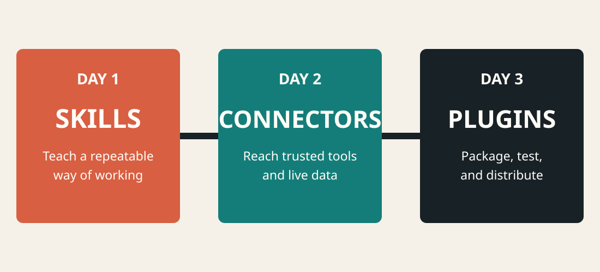

<!-- _class: lead -->
<!-- _paginate: false -->

# Day 3: Package Claude Plugins

### From local customization to reusable product

**Build:** a catalog-assistant plugin · **Format:** explain, demo, capstone

---

## Outcomes

By 16:30, learners can:

1. Decide when standalone configuration should become a plugin
2. Structure a plugin with manifest, Skills, agents, hooks, and MCP servers
3. Load, reload, validate, and troubleshoot a plugin locally
4. Plan safe versioning and marketplace distribution



---

## Day plan

| Time | Module | Mode |
|---|---|---|
| 09:00 | Plugin mental model and anatomy | Teach |
| 10:00 | Load the catalog plugin | Demo |
| 10:45 | Extend and validate | Lab |
| 13:00 | Components, versioning, distribution | Workshop |
| 14:30 | Team capstone | Build + demo |
| 16:00 | Review and next steps | Checkpoint |

---

## When to package

| Standalone `.claude/` | Plugin |
|---|---|
| One person or one repository | Reused across projects or teams |
| Fast experimentation | Versioned release |
| Unnamespaced `/review` | Namespaced `/catalog-assistant:review` |
| Manual copying | Marketplace installation |

Prototype standalone. Package when the behavior is stable enough to support users.

---

## Plugin packaging flow



A plugin is a **distribution boundary**, not merely a folder rename.

---

## Correct directory anatomy

```text
catalog-assistant/
├── .claude-plugin/
│   └── plugin.json
├── skills/
│   └── recommend-product/SKILL.md
├── agents/
│   └── catalog-reviewer.md
└── .mcp.json
```

Only `plugin.json` belongs inside `.claude-plugin/`. Components sit at the plugin root.

---

## Components and responsibilities

| Component | Responsibility |
|---|---|
| Skill | Reusable expertise or workflow |
| Agent | Focused persona, context, and tool set |
| Hook | Deterministic response to lifecycle events |
| MCP server | External tools, resources, and prompts |
| LSP server | Code intelligence |
| Monitor | Background event stream |

Add a component only when its responsibility is clear and testable.

---

## Manifest as product identity

```json
{
  "name": "catalog-assistant",
  "description": "Safe product lookup and recommendation workflows",
  "version": "1.0.0",
  "author": { "name": "Course Team" }
}
```

The name becomes the Skill namespace. Bump the version when installed users should receive an update.

---

<!-- _class: demo -->

## Demo 1 · Inspect the plugin

**Show:** `demos/day-3-plugins/catalog-assistant/`

1. Read identity from `.claude-plugin/plugin.json`
2. Trace the recommendation Skill
3. Inspect the catalog-reviewer agent
4. Find `${CLAUDE_PLUGIN_ROOT}` in `.mcp.json`

**Success signal:** learners can explain every top-level entry.

---

<!-- _class: demo -->

## Demo 2 · Load locally

From the course repository:

```powershell
claude --plugin-dir ./demos/day-3-plugins/catalog-assistant
```

Inside Claude Code:

```text
/catalog-assistant:recommend-product remote work under $150
```

Open `/mcp` and `/context`; show the plugin Skill, server, and custom agent.

---

## Namespaces prevent collisions

Plugin Skills use:

```text
/plugin-name:skill-name
```

The starter creates:

```text
/catalog-assistant:recommend-product
```

Namespaces let multiple plugins define a `review` or `deploy` Skill without silently replacing one another.

---

<!-- _class: demo -->

## Demo 3 · Edit and reload

1. Add a budget rule to the recommendation Skill
2. In Claude Code, run `/reload-plugins`
3. Invoke the Skill with the same prompt
4. Compare the result before and after
5. Check `/plugin` → Errors if reload reports a problem

**Show on screen:** the reload summary and changed behavior.

<!-- Presenter: A plugin Skill edit may require reload; standalone Skill text is watched live. -->

---

<!-- _class: exercise -->

## Lab 1 · Convert your Day 1 Skill

**Timebox: 55 minutes**

1. Create a plugin directory and manifest
2. Move a copy of your Skill under `skills/`
3. Choose a clear plugin namespace
4. Load with `claude --plugin-dir`
5. Test direct and automatic invocation
6. Run `/reload-plugins` after one improvement

**Deliverable:** a locally loading plugin with one tested Skill.

---

## Bundle an MCP server safely

```json
{
  "mcpServers": {
    "catalog": {
      "command": "node",
      "args": ["${CLAUDE_PLUGIN_ROOT}/servers/catalog.mjs"]
    }
  }
}
```

Use `${CLAUDE_PLUGIN_ROOT}` so paths work wherever the plugin is installed. Never assume the caller's working directory.

---

## Validate before distribution

```powershell
claude plugin validate ./demos/day-3-plugins/catalog-assistant
```

Then test:

1. Each Skill by namespaced command
2. Agents in `/context`
3. MCP status and every exposed capability
4. Hook events and exit codes, if present
5. Failure behavior with missing dependencies and denied permissions

Use `--strict` when warnings should fail CI.

---

## Version and release deliberately

1. Record user-visible changes
2. Apply semantic versioning consistently
3. Validate in CI
4. Test from a clean environment
5. Publish through a trusted marketplace
6. Document permissions, dependencies, and data access

Installed users receive versioned artifacts, so test the artifact rather than only your source tree.

---

## Marketplace path

1. Create a marketplace repository and catalog
2. Point entries to versioned plugin sources
3. Add it with `/plugin marketplace add <owner>/<repo>`
4. Install with `/plugin install <plugin>@<marketplace>`
5. Update the catalog and plugin version for releases

For public submission, validate locally and follow Anthropic's current community marketplace review process.

---

## Plugin security review

- Read Skills, hooks, executables, and MCP configuration before enabling
- Document every external endpoint and environment variable
- Keep credentials outside the plugin and repository
- Avoid broad tool grants and hidden side effects
- Pin or review third-party dependencies
- Provide disable, uninstall, and rollback paths
- Treat marketplace trust as supply-chain trust

---

<!-- _class: exercise -->

## Capstone · Build the extension story

**Timebox: 75 minutes · teams of 2–3**

Package a real workflow with:

1. One Skill from Day 1
2. One connector design from Day 2, mocked if necessary
3. A manifest and local load command
4. Three acceptance tests and two abuse tests
5. A three-minute demo using a demo-switch screen

**Definition of done:** another team can load, understand, and safely test it.

---

<!-- _class: demo -->

## Team demo screen

**Switch from slides to Claude Code now.**

Show only:

1. The user problem
2. The namespaced Skill invocation
3. The connector/tool boundary
4. The successful result
5. One safety control

**Timebox:** 3 minutes demo + 2 minutes feedback.

---

<!-- _class: checkpoint -->

## Final checkpoint

Can you now explain the complete progression?

1. **Skill:** teach Claude a repeatable method
2. **Connector:** give that method controlled access to a system
3. **Plugin:** package the method and integration for others
4. **Evaluation:** prove routing, quality, safety, and maintainability

Write one action you will take in the next seven days.

---

<!-- _class: closing -->
<!-- _paginate: false -->

# Course complete

Build small. Test fresh. Grant less. Share deliberately.

Reference: `https://code.claude.com/docs/en/plugins`
